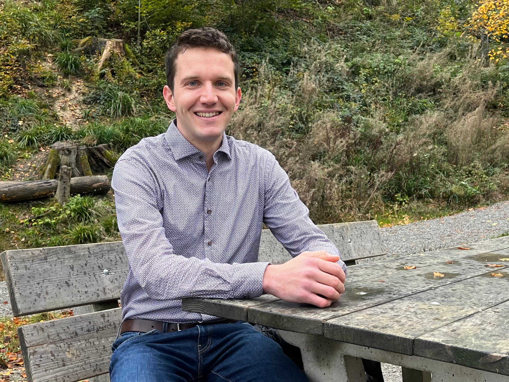

## About me

I am a Postdoctoral Researcher at **ETH Zurich** working in the [Coletti Group](https://ifd.ethz.ch/research/group-coletti.html). Before coming to Zurich, I earned my Ph.D. in Mechanical and Aerospace Engineering in 2022 at **Princeton University** working in the [Deike Lab](https://ldeike.princeton.edu/), and I earned my bachelor's degree in Mechanical Engineering at the **Pennsylvania State University** in 2016.

I've enjoyed internships at **Volvo Group Trucks Technology** (2015), the Combustion Research Facility at **Sandia National Laboratories** (2016), and the **National Renewable Energy Laboratory** (2017).

You can download my full CV [here](https://danjruth.github.io/CV_DanielRuth.pdf).

---

### Awards & funding

- **2020 School of Engineering and Applied Science [Award for Excellence](https://engineering.princeton.edu/news/2020/12/03/award-excellence-honors-graduate-student-achievement)**, awarded to School of Engineering and Applied Science advanced graduate students who have "performed at the highest level as scholars and researchers"
- **2020 Princeton University Mechanical and Aerospace Engineering [Research Day](https://mae.princeton.edu/about-mae/news/daniel-ruth-nikita-dutta-win-1st-2nd-prizes-mae-research-day)** First Prize, awarded by a panel of faculty and students to one MAE graduate student for a research presentation during the annual Research Day event 
- **2020 [Mary and Randall Hack ’69 Graduate Award](https://environment.princeton.edu/news/hack-graduate-award-recipients-explore-water-issues-from-groundwater-cleanup-to-carbon-capturing-crystals/)** funding to purchase laboratory equipment to measure dissolved oxygen concentrations in multiphase turbulent flows
- **2015 [John P. Karidis Department Head's Award for Research](https://www.me.psu.edu/students/undergraduate/Award-Karidis.aspx)**, awarded by the Penn State Department of Mechanical and Nuclear Engineering to the Mechanical Engineering student “who has made the most important contribution in forwarding the research in his or her selected area of study”
